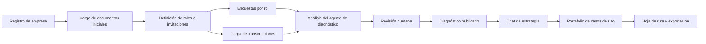
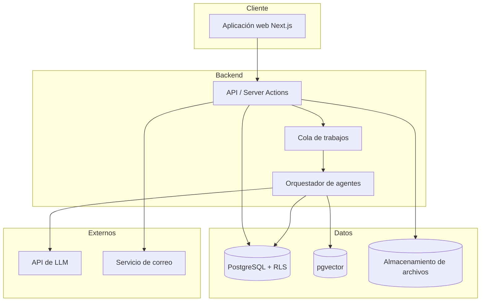
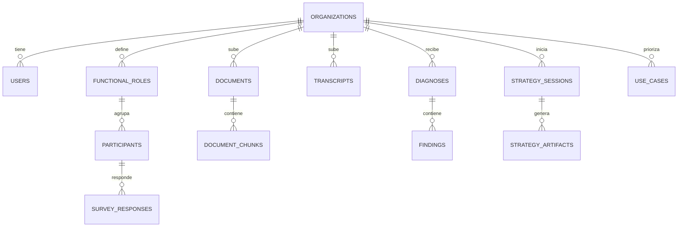
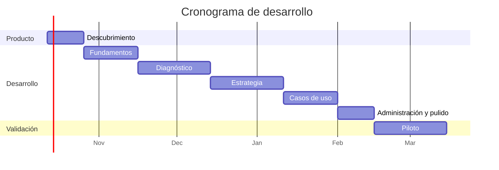

# Plan de Desarrollo — Plataforma de Adopción de IA para Empresas

| Campo | Valor |
|---|---|
| Versión | 1.0 |
| Estado | Borrador para revisión |
| Fecha | Octubre 2026 |
| Tipo de documento | Plan de desarrollo de producto |

---

## Tabla de contenido

1. [Resumen ejecutivo](#1-resumen-ejecutivo)
2. [Objetivos del proyecto](#2-objetivos-del-proyecto)
3. [Alcance](#3-alcance)
4. [Usuarios y roles](#4-usuarios-y-roles)
5. [Flujo funcional](#5-flujo-funcional)
6. [Metodología del diagnóstico](#6-metodología-del-diagnóstico)
7. [Módulos funcionales](#7-módulos-funcionales)
8. [Arquitectura técnica](#8-arquitectura-técnica)
9. [Modelo de datos](#9-modelo-de-datos)
10. [Diseño de los agentes de IA](#10-diseño-de-los-agentes-de-ia)
11. [Seguridad, privacidad y cumplimiento](#11-seguridad-privacidad-y-cumplimiento)
12. [Fases y cronograma](#12-fases-y-cronograma)
13. [Equipo requerido](#13-equipo-requerido)
14. [Estrategia de calidad y evaluación](#14-estrategia-de-calidad-y-evaluación)
15. [Riesgos y mitigaciones](#15-riesgos-y-mitigaciones)
16. [Propuesta de MVP](#16-propuesta-de-mvp)
17. [Decisiones pendientes](#17-decisiones-pendientes)
18. [Glosario](#18-glosario)

---

## 1. Resumen ejecutivo

Este documento describe el plan para construir una plataforma web, impulsada por agentes de IA, que acompaña a las empresas en su proceso de adopción de inteligencia artificial.

La plataforma guía a cada organización por un recorrido estructurado en cuatro etapas:

1. **Onboarding:** registro de la empresa y carga de documentos iniciales.
2. **Diagnóstico:** evaluación de madurez en IA basada en metodologías reconocidas, a partir de encuestas por rol y transcripciones de reuniones.
3. **Estrategia:** construcción asistida de la estrategia de IA mediante un chat guiado.
4. **Portafolio de casos de uso:** visualización y priorización de iniciativas con indicadores, tecnología sugerida, impacto cuantitativo y niveles de complejidad legal, ética y de infraestructura.

Un superadministrador supervisa todas las empresas registradas, su avance y sus resultados.

---

## 2. Objetivos del proyecto

### 2.1 Objetivos de negocio

- Estandarizar y escalar el proceso de acompañamiento en adopción de IA, reduciendo el tiempo de consultoría manual por empresa.
- Ofrecer un diagnóstico creíble, sustentado en marcos reconocidos internacionalmente y en evidencia trazable.
- Entregar a cada empresa un portafolio priorizado de casos de uso listo para ejecución.

### 2.2 Objetivos de producto

- Permitir que una empresa complete el recorrido completo de forma autónoma, con revisión opcional de un consultor.
- Garantizar que cada hallazgo del diagnóstico esté respaldado por evidencia (respuestas de encuesta o citas de transcripciones).
- Generar artefactos estructurados (objetivos, OKRs, casos de uso) que puedan editarse, exportarse y compararse.

### 2.3 Indicadores de éxito

| Indicador | Meta inicial |
|---|---|
| Tiempo desde registro hasta diagnóstico publicado | ≤ 3 semanas |
| Tasa de respuesta de encuestas por rol | ≥ 80 % |
| Hallazgos del diagnóstico con evidencia citada | 100 % |
| Satisfacción del cliente con el diagnóstico (escala 1–5) | ≥ 4,2 |
| Casos de uso aprobados por empresa | ≥ 5 |

---

## 3. Alcance

### 3.1 Dentro del alcance

- Plataforma web multiempresa (multi-tenant) con autenticación y roles.
- Carga y procesamiento de documentos (PDF, DOCX, TXT) y transcripciones (TXT, VTT, SRT, DOCX).
- Encuestas configurables por rol funcional, respondidas mediante enlace de invitación.
- Generación automática del diagnóstico con revisión humana antes de su publicación.
- Chat de estrategia guiado por etapas, con persistencia de artefactos.
- Módulo de casos de uso con matriz de priorización y hoja de ruta.
- Panel de superadministración con vista consolidada de todas las empresas.
- Exportación de informes a PDF y Word.

### 3.2 Fuera del alcance (versión 1)

- Implementación técnica de los casos de uso identificados.
- Integración directa con plataformas de videoconferencia (prevista para versiones posteriores).
- Aplicación móvil nativa.
- Facturación y pagos dentro de la plataforma.

---

## 4. Usuarios y roles

| Rol | Descripción | Permisos principales |
|---|---|---|
| **Superadministrador** | Equipo operador de la plataforma | Ver y gestionar todas las empresas, revisar y publicar diagnósticos, administrar bancos de preguntas, ver analítica agregada |
| **Administrador de empresa** | Responsable del proceso dentro de la organización cliente | Registrar la empresa, subir documentos y transcripciones, definir roles e invitar participantes, usar el chat de estrategia, gestionar casos de uso |
| **Participante** | Representante de un área funcional (legal, mercadeo, operaciones, TI, finanzas, talento humano, etc.) | Responder la encuesta asignada a su rol mediante enlace, sin necesidad de cuenta completa |
| **Consultor** *(opcional)* | Experto que acompaña a una o varias empresas | Revisar y ajustar diagnósticos, comentar estrategias y casos de uso de las empresas asignadas |

---

## 5. Flujo funcional

### Estados del recorrido de una empresa

`REGISTRADA` → `DOCUMENTOS_CARGADOS` → `DIAGNOSTICO_EN_CURSO` → `DIAGNOSTICO_EN_REVISION` → `DIAGNOSTICO_PUBLICADO` → `ESTRATEGIA_EN_CURSO` → `ESTRATEGIA_COMPLETA` → `PORTAFOLIO_APROBADO`

---

## 6. Metodología del diagnóstico

El diagnóstico usa un modelo híbrido construido sobre marcos reconocidos, lo que aporta credibilidad frente a los clientes y comparabilidad entre empresas.

### 6.1 Marcos de referencia

| Marco | Uso en la plataforma |
|---|---|
| **Cisco AI Readiness Index** | Estructura de seis pilares de evaluación |
| **Gartner AI Maturity Model** | Escala de cinco niveles de madurez para comunicar el resultado |
| **NIST AI Risk Management Framework** | Criterios de evaluación de riesgo y gobernanza |
| **ISO/IEC 42001** | Referencia para sistemas de gestión de IA |
| **EU AI Act** | Clasificación del nivel de riesgo de los casos de uso |
| **Normativa colombiana** (Ley 1581 de 2012, CONPES 4144) | Contexto legal local de protección de datos y política nacional de IA |

### 6.2 Pilares evaluados

1. **Estrategia:** existencia de visión, patrocinio directivo y presupuesto para IA.
2. **Infraestructura:** capacidad tecnológica, nube, integración de sistemas y seguridad.
3. **Datos:** disponibilidad, calidad, centralización y gobierno de los datos.
4. **Gobernanza:** políticas, gestión de riesgos, cumplimiento y ética.
5. **Talento:** habilidades disponibles, formación y capacidad de contratación.
6. **Cultura:** disposición al cambio, experimentación y adopción por parte de los equipos.

### 6.3 Niveles de madurez

| Nivel | Nombre | Descripción |
|---|---|---|
| 1 | Conciencia | Interés en la IA, sin iniciativas concretas |
| 2 | Activo | Experimentos aislados y pruebas de concepto |
| 3 | Operacional | Al menos un caso de IA en producción con valor medible |
| 4 | Sistémico | La IA se considera en todos los proyectos nuevos |
| 5 | Transformacional | La IA forma parte del modelo de negocio |

### 6.4 Encuestas por rol

Cada rol funcional recibe un banco de preguntas específico. Todas las preguntas se mapean a uno o más pilares, con una ponderación definida.

| Rol | Enfoque de las preguntas |
|---|---|
| Legal | Protección de datos, contratos con proveedores, cumplimiento regulatorio, propiedad intelectual |
| Mercadeo | Datos de clientes, personalización, generación de contenido, analítica |
| Operaciones | Procesos repetitivos, cuellos de botella, calidad, cadena de suministro |
| TI | Arquitectura, infraestructura, seguridad, integración, calidad de datos |
| Finanzas | Presupuesto, medición de retorno, procesos contables automatizables |
| Talento humano | Habilidades, formación, gestión del cambio, cultura |
| Dirección | Visión, prioridades, apetito de riesgo, patrocinio |

**Formato de preguntas:** escala Likert de 1 a 5 como base, con preguntas abiertas complementarias para enriquecer el análisis cualitativo.

### 6.5 Cálculo del diagnóstico

El resultado combina dos fuentes:

1. **Componente cuantitativo:** puntajes de las encuestas, ponderados por pilar y por rol.
2. **Componente cualitativo:** hallazgos extraídos de las transcripciones por el agente de IA, clasificados por pilar y acompañados de su cita textual.

El sistema detecta **contradicciones** entre fuentes (por ejemplo, TI afirma que los datos están centralizados mientras operaciones describe archivos dispersos) y las presenta como hallazgos destacados.

---

## 7. Módulos funcionales

### 7.1 Módulo de onboarding

- Registro de la empresa: razón social, NIT, sector, tamaño, país y ciudad.
- Creación de la cuenta del administrador de empresa.
- Carga de documentos iniciales: plan estratégico, organigrama, mapa de procesos, informes de TI, políticas internas.
- Procesamiento automático: extracción de texto, fragmentación y generación de embeddings.

### 7.2 Módulo de diagnóstico

- Configuración de los roles participantes a partir de una lista base editable.
- Envío de invitaciones por correo con enlace único y fecha límite.
- Seguimiento del avance de respuestas por rol, con recordatorios automáticos.
- Carga de transcripciones de reuniones, asociadas a uno o varios roles.
- Ejecución del análisis por parte del agente de diagnóstico.
- Flujo de revisión humana: el consultor o superadministrador puede editar, aprobar o rechazar hallazgos antes de publicar.
- Informe final con: nivel de madurez general, puntaje por pilar (gráfico de radar), hallazgos con evidencia, brechas y recomendaciones.

### 7.3 Módulo de estrategia

- Chat guiado por etapas:
  1. Visión de IA de la organización.
  2. Objetivos de negocio que la IA debe apoyar.
  3. Principios de gobernanza y uso responsable.
  4. Identificación de oportunidades y casos de uso candidatos.
  5. Definición de OKRs.
- El agente tiene acceso al diagnóstico, a los documentos de la empresa y al contexto del sector.
- Los artefactos generados (objetivos, principios, OKRs, casos candidatos) se guardan como datos estructurados y pueden editarse fuera del chat.
- Panel lateral que muestra el avance por etapa y los artefactos ya consolidados.

### 7.4 Módulo de casos de uso

Cada caso de uso se representa como una ficha con los siguientes campos:

| Campo | Descripción |
|---|---|
| Nombre y descripción | Problema que resuelve y área responsable |
| Indicador (KPI) | Métrica, línea base, meta y plazo |
| Tecnología sugerida | Por ejemplo: LLM con RAG, visión por computador, modelos predictivos, agentes, RPA con IA |
| Impacto cuantitativo | Horas ahorradas, reducción de costos, aumento de ingresos y ROI estimado, con los supuestos del cálculo visibles y editables |
| Complejidad legal (1–5) | Con justificación: datos personales, regulación sectorial, contratos |
| Complejidad ética (1–5) | Con justificación: sesgos, transparencia, impacto en personas |
| Complejidad de infraestructura (1–5) | Con justificación: integraciones, datos requeridos, capacidad técnica |
| Nivel de riesgo | Clasificación según EU AI Act (mínimo, limitado, alto) |
| Estado | Propuesto, aprobado, en piloto, en producción, descartado |

**Vistas disponibles:**

- **Matriz de priorización:** impacto contra complejidad total, con cuadrantes de *quick wins*, proyectos estratégicos, mejoras menores y proyectos a reconsiderar.
- **Vista de tarjetas** con filtros por área, tecnología, estado y nivel de complejidad.
- **Hoja de ruta** organizada por trimestres.
- **Comparador** de dos o tres casos lado a lado.

### 7.5 Módulo de superadministración

- Listado de empresas con estado del recorrido, avance y fecha de última actividad.
- Acceso de lectura a diagnósticos, estrategias y portafolios de cada empresa.
- Cola de diagnósticos pendientes de revisión.
- Gestión de bancos de preguntas, roles base y plantillas.
- Analítica agregada: madurez promedio por sector, pilares más débiles, tecnologías más sugeridas.
- Registro de auditoría de acciones relevantes.

---

## 8. Arquitectura técnica

### 8.1 Stack propuesto

| Capa | Tecnología | Justificación |
|---|---|---|
| Frontend | Next.js (React) + TypeScript + Tailwind CSS | Ecosistema maduro, renderizado del lado del servidor, buena experiencia de desarrollo |
| Backend | Next.js API Routes / Server Actions | Reduce la complejidad operativa en etapas tempranas |
| Base de datos | PostgreSQL (Supabase) | Row-level security para multi-tenancy, pgvector incluido |
| Búsqueda vectorial | pgvector | Evita un servicio adicional en la versión inicial |
| Autenticación | Supabase Auth | Soporte de correo, enlaces mágicos y SSO |
| Almacenamiento | Supabase Storage | Archivos cifrados con control de acceso por empresa |
| Modelos de lenguaje | API de Claude (Anthropic) | Modelos de mayor capacidad para análisis y chat; modelos ligeros para clasificación masiva |
| Procesamiento asíncrono | Inngest, Trigger.dev o BullMQ | Procesamiento de documentos y análisis largos fuera de la petición web |
| Visualización | Recharts o ECharts | Radar de madurez, matriz de priorización, hoja de ruta |
| Exportación | Generación de PDF y DOCX en servidor | Informes formales descargables |
| Observabilidad | Sentry + Langfuse (o similar) | Errores de aplicación y trazabilidad de llamadas a LLM |

### 8.2 Diagrama de arquitectura

### 8.3 Multi-tenancy

- Todas las tablas de negocio incluyen la columna `organization_id`.
- Políticas de row-level security en PostgreSQL impiden el acceso cruzado entre empresas, incluso ante errores en la capa de aplicación.
- Los archivos se almacenan en rutas separadas por empresa, con políticas de acceso equivalentes.
- Las búsquedas vectoriales siempre se filtran por `organization_id`.

> **Decisión crítica:** el aislamiento entre empresas debe implementarse desde el primer sprint. Corregirlo después implica migraciones costosas y riesgo de exposición de datos.

---

## 9. Modelo de datos

### 9.1 Entidades principales

| Entidad | Campos clave |
|---|---|
| `organizations` | id, nombre, nit, sector, tamaño, país, estado_recorrido, created_at |
| `users` | id, email, nombre, rol_plataforma, organization_id |
| `functional_roles` | id, organization_id, nombre, descripción |
| `participants` | id, organization_id, functional_role_id, nombre, email, token_invitación, estado |
| `documents` | id, organization_id, tipo, nombre_archivo, ruta, texto_extraído, estado_procesamiento |
| `document_chunks` | id, document_id, organization_id, contenido, embedding |
| `question_banks` | id, functional_role_nombre, versión, activo |
| `questions` | id, question_bank_id, texto, tipo, pilar, peso |
| `survey_responses` | id, participant_id, question_id, valor, texto_abierto |
| `transcripts` | id, organization_id, título, fecha_reunión, roles_asociados, texto, estado |
| `diagnoses` | id, organization_id, versión, nivel_madurez, puntajes_pilares (JSON), estado, revisado_por, publicado_at |
| `findings` | id, diagnosis_id, pilar, tipo (fortaleza, brecha, contradicción), descripción, evidencias (JSON) |
| `strategy_sessions` | id, organization_id, etapa_actual, estado |
| `strategy_messages` | id, session_id, rol, contenido, created_at |
| `strategy_artifacts` | id, session_id, tipo (visión, objetivo, principio, okr), contenido (JSON) |
| `use_cases` | id, organization_id, nombre, descripción, área, kpi (JSON), tecnología, impacto (JSON), complejidad_legal, complejidad_ética, complejidad_infra, justificaciones (JSON), nivel_riesgo, estado, trimestre |
| `audit_logs` | id, organization_id, user_id, acción, entidad, metadatos, created_at |

### 9.2 Relaciones principales

---

## 10. Diseño de los agentes de IA

### 10.1 Agente de procesamiento de documentos

- **Entrada:** archivos cargados por la empresa.
- **Proceso:** extracción de texto, limpieza, fragmentación, clasificación por tipo de documento y generación de embeddings.
- **Modelo:** ligero y de bajo costo.
- **Salida:** fragmentos indexados y un resumen de cada documento.

### 10.2 Agente de diagnóstico

Se ejecuta como un pipeline de varios pasos:

1. **Extracción:** recorre cada transcripción en fragmentos y extrae afirmaciones relevantes, clasificadas por pilar, con la cita textual exacta.
2. **Consolidación:** agrupa afirmaciones similares y elimina duplicados.
3. **Cruce:** compara los hallazgos cualitativos con los puntajes de las encuestas y detecta contradicciones.
4. **Puntuación:** propone un ajuste del puntaje cualitativo por pilar, justificado.
5. **Redacción:** genera el informe con fortalezas, brechas, contradicciones y recomendaciones.

**Reglas obligatorias:**

- Todo hallazgo debe incluir al menos una evidencia (cita o referencia a respuesta de encuesta).
- Los hallazgos sin evidencia se descartan automáticamente.
- Las salidas se generan en formato JSON validado contra un esquema.
- El resultado queda en estado `EN_REVISION` hasta su aprobación humana.

### 10.3 Agente de estrategia

- Conversa con el administrador de empresa siguiendo las etapas definidas en la sección 7.3.
- Usa recuperación aumentada (RAG) sobre los documentos de la empresa y el diagnóstico publicado.
- Dispone de herramientas (*tool calling*) para:
  - `guardar_artefacto(tipo, contenido)`
  - `actualizar_artefacto(id, contenido)`
  - `proponer_caso_de_uso(datos)`
  - `avanzar_etapa()`
  - `consultar_diagnostico(pilar)`
- Mantiene un resumen del estado de la conversación para controlar el tamaño del contexto.

### 10.4 Agente de casos de uso

- Toma los casos candidatos del chat de estrategia y completa sus fichas.
- Estima el impacto cuantitativo declarando explícitamente cada supuesto.
- Evalúa las tres dimensiones de complejidad con justificación y clasifica el nivel de riesgo regulatorio.
- Sugiere la tecnología más adecuada según el problema y la madurez de la empresa.
- Todas las estimaciones son editables por el usuario.

### 10.5 Gestión de prompts

- Los prompts se versionan en el repositorio, en un directorio dedicado (`/prompts`).
- Cada ejecución registra la versión de prompt y de modelo utilizada, para trazabilidad.

---

## 11. Seguridad, privacidad y cumplimiento

| Aspecto | Medida |
|---|---|
| Aislamiento de datos | Row-level security en base de datos y almacenamiento |
| Cifrado | En tránsito (TLS) y en reposo |
| Consentimiento | Aviso y aceptación explícita antes de cargar transcripciones y responder encuestas |
| Datos personales | Opción de anonimizar nombres en transcripciones antes del análisis |
| Retención | Política configurable de retención y eliminación de datos por empresa |
| Proveedores de IA | Uso de proveedores que no entrenen modelos con los datos enviados vía API |
| Auditoría | Registro de accesos y acciones sobre información sensible |
| Marco legal | Cumplimiento de la Ley 1581 de 2012 y acuerdos de tratamiento de datos con cada cliente |
| Autenticación | Contraseñas robustas o enlaces mágicos; autenticación de dos factores para administradores |

---

## 12. Fases y cronograma

| Fase | Duración | Entregables principales |
|---|---|---|
| **0. Descubrimiento** | 2 semanas | Metodología cerrada, bancos de preguntas por rol, criterios de puntuación, prototipo navegable en Figma |
| **1. Fundamentos** | 3 semanas | Autenticación, multi-tenancy, registro de empresas, carga y procesamiento de documentos, panel básico de superadministración |
| **2. Diagnóstico** | 4 semanas | Gestión de roles e invitaciones, encuestas, carga de transcripciones, pipeline del agente de diagnóstico, flujo de revisión, informe con evidencia |
| **3. Estrategia** | 3–4 semanas | Chat guiado con RAG, herramientas del agente, artefactos estructurados editables |
| **4. Casos de uso** | 3 semanas | Fichas completas, matriz de priorización, hoja de ruta, comparador |
| **5. Administración y pulido** | 2 semanas | Analítica agregada, exportación a PDF y Word, auditoría, ajustes de UX |
| **6. Piloto** | 4 semanas | Acompañamiento a 2–3 empresas reales, ajuste de prompts, preguntas y puntuación |

**Duración total estimada:** entre 21 y 22 semanas (aproximadamente 5 a 6 meses).

> Las fechas del diagrama son ilustrativas y deben ajustarse a la fecha real de inicio.

---

## 13. Equipo requerido

| Rol | Dedicación | Responsabilidades |
|---|---|---|
| Líder de producto / consultor en IA | Tiempo completo | Metodología, bancos de preguntas, priorización, validación con clientes |
| Desarrollador full-stack (×2) | Tiempo completo | Frontend, backend, base de datos, integraciones |
| Ingeniero de IA | Tiempo completo | Agentes, prompts, RAG, evaluaciones, optimización de costos |
| Diseñador UX/UI | Medio tiempo | Prototipos, sistema de diseño, visualizaciones |
| QA | Medio tiempo (desde la fase 2) | Pruebas funcionales y de regresión |

---

## 14. Estrategia de calidad y evaluación

### 14.1 Pruebas de software

- Pruebas unitarias para la lógica de puntuación y cálculo de impacto.
- Pruebas de integración para las políticas de aislamiento entre empresas.
- Pruebas end-to-end de los flujos críticos (registro, encuesta, diagnóstico, estrategia).

### 14.2 Evaluación de los agentes

- **Conjunto de evaluación:** transcripciones y encuestas de prueba con diagnósticos de referencia elaborados por expertos.
- **Métricas:**
  - Proporción de hallazgos con evidencia válida.
  - Coincidencia del nivel de madurez con el asignado por expertos.
  - Tasa de alucinaciones (afirmaciones sin sustento en las fuentes).
  - Calificación de expertos sobre la utilidad de las recomendaciones.
- Toda modificación de prompts o de modelo se valida contra el conjunto de evaluación antes de desplegarse.

### 14.3 Monitoreo en producción

- Trazas de todas las llamadas a modelos de lenguaje, con costo y latencia.
- Retroalimentación de usuarios (útil / no útil) sobre hallazgos y respuestas del chat.
- Alertas de costo por empresa.

---

## 15. Riesgos y mitigaciones

| Riesgo | Probabilidad | Impacto | Mitigación |
|---|---|---|---|
| Alucinaciones en el diagnóstico | Media | Alto | Evidencia obligatoria, esquemas JSON validados, revisión humana antes de publicar |
| Fuga de información entre empresas | Baja | Crítico | Row-level security, pruebas automatizadas de aislamiento, auditoría |
| Baja tasa de respuesta de las encuestas | Alta | Medio | Encuestas cortas, recordatorios automáticos, seguimiento visible para el administrador |
| Costos elevados de LLM con transcripciones largas | Media | Medio | Modelos ligeros para preprocesamiento, caché de análisis, límites por empresa |
| Cifras de impacto poco creíbles | Media | Alto | Supuestos visibles y editables, rangos en lugar de valores únicos |
| Rechazo a compartir transcripciones por confidencialidad | Media | Alto | Anonimización, acuerdos de confidencialidad, opción de diagnóstico solo con encuestas |
| Desviación del alcance | Alta | Medio | MVP definido, priorización estricta, revisión quincenal del backlog |

---

## 16. Propuesta de MVP

Para validar el producto con clientes reales en el menor tiempo posible, se propone un MVP de **8 a 10 semanas** con el siguiente alcance:

**Incluido:**

- Registro de empresas y multi-tenancy.
- Carga de documentos y transcripciones.
- Encuestas por rol con invitaciones.
- Diagnóstico automático con revisión obligatoria por consultor.
- Módulo de casos de uso con fichas y matriz de priorización (casos creados manualmente o sugeridos a partir del diagnóstico).
- Panel básico de superadministración.

**Pospuesto a la versión 1.1:**

- Chat de estrategia guiado completo.
- Analítica agregada entre empresas.
- Comparador de casos de uso y hoja de ruta avanzada.
- Integración con plataformas de videoconferencia.

**Justificación:** el diagnóstico es el componente de mayor valor percibido y el que más necesita validación con datos reales. El chat de estrategia se beneficiará de los aprendizajes del piloto.

---

## 17. Decisiones pendientes

| # | Decisión | Responsable | Fecha objetivo |
|---|---|---|---|
| 1 | Confirmar el marco metodológico final y los pesos por pilar | Líder de producto | Fin de fase 0 |
| 2 | Definir la lista base de roles y la extensión de cada encuesta | Líder de producto | Fin de fase 0 |
| 3 | Elegir proveedor de cola de trabajos | Equipo técnico | Inicio de fase 1 |
| 4 | Definir si la revisión humana es obligatoria u opcional en producción | Dirección | Fin de fase 2 |
| 5 | Modelo de despliegue (nube pública, región de alojamiento de datos) | Equipo técnico y legal | Inicio de fase 1 |
| 6 | Modelo comercial (por empresa, por usuario, por recorrido) | Dirección | Antes del piloto |

---

## 18. Glosario

| Término | Definición |
|---|---|
| **Multi-tenancy** | Arquitectura en la que una sola instancia de la aplicación atiende a múltiples empresas con sus datos aislados |
| **RLS (Row-Level Security)** | Mecanismo de PostgreSQL que restringe qué filas puede ver o modificar cada usuario |
| **RAG** | Generación aumentada por recuperación: técnica que alimenta al modelo con fragmentos relevantes de documentos propios |
| **Embedding** | Representación numérica de un texto que permite buscar contenido por similitud de significado |
| **Tool calling** | Capacidad del modelo de invocar funciones definidas por la aplicación |
| **Quick win** | Caso de uso de alto impacto y baja complejidad, recomendado para ejecutar primero |
| **OKR** | Objetivos y resultados clave: metodología para definir metas medibles |
| **Pilar** | Dimensión de evaluación de la madurez en IA |
