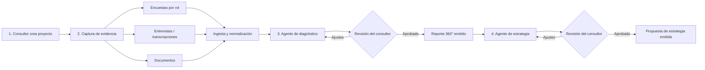
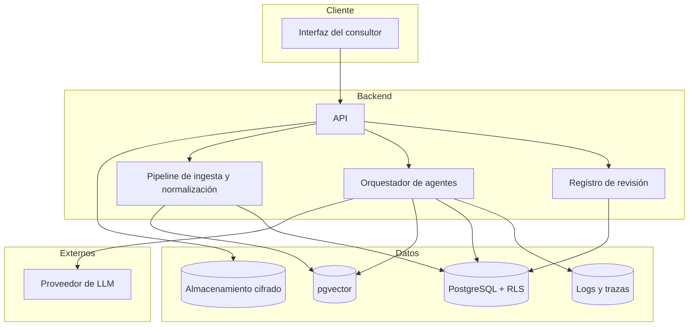
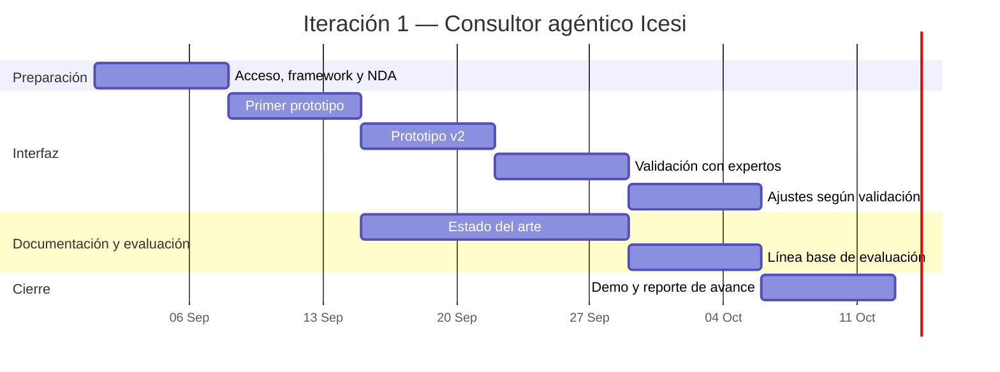

# Plan de Desarrollo — Consultor agéntico Icesi

**Plataforma de diagnóstico y estrategia para la adopción de IA · Caso piloto: Banco AV Villas**

| Campo | Valor |
|---|---|
| Proyecto | Consultor agéntico Icesi |
| Caso piloto | Banco AV Villas |
| Programa | Maestría en Inteligencia Artificial Aplicada — Facultad Barberi de Ingeniería, Diseño y Ciencias Aplicadas, Universidad Icesi |
| Tipo | Trabajo de grado (solución aplicada de IA generativa) |
| Equipo | Santiago Aristizábal Morales · Alejandra Forero Rodríguez |
| Versión | 2.0 |
| Fecha | 2 de octubre de 2026 |
| Estado | Iteración 1 en curso (semana 5 de 6) |

> **Nota de alcance.** Esta versión incorpora el plan de trabajo ajustado del trabajo de grado. Tras la reunión de alineación con José Armando Ordóñez Córdoba, la primera iteración se concentra en las fases de **diagnóstico y estrategia** del framework de adopción de IA de Icesi, con un horizonte de 4 a 6 semanas. La priorización de retos, la validación con Golden Set y la medición de costos quedan para iteraciones posteriores.

---

## Tabla de contenido

1. [Resumen ejecutivo](#1-resumen-ejecutivo)
2. [Contexto y definición del problema](#2-contexto-y-definición-del-problema)
3. [Objetivos](#3-objetivos)
4. [Alcance por iteraciones](#4-alcance-por-iteraciones)
5. [Usuarios y roles](#5-usuarios-y-roles)
6. [Flujo funcional](#6-flujo-funcional)
7. [Metodología de diagnóstico y estrategia](#7-metodología-de-diagnóstico-y-estrategia)
8. [Módulos funcionales](#8-módulos-funcionales)
9. [Arquitectura técnica](#9-arquitectura-técnica)
10. [Modelo de datos](#10-modelo-de-datos)
11. [Diseño de los agentes](#11-diseño-de-los-agentes)
12. [Confidencialidad, ética y cumplimiento](#12-confidencialidad-ética-y-cumplimiento)
13. [Evaluación y métricas](#13-evaluación-y-métricas)
14. [Cronograma](#14-cronograma)
15. [Equipo y gobierno del proyecto](#15-equipo-y-gobierno-del-proyecto)
16. [Riesgos y mitigaciones](#16-riesgos-y-mitigaciones)
17. [Trazabilidad con la rúbrica de la Maestría](#17-trazabilidad-con-la-rúbrica-de-la-maestría)
18. [Decisiones pendientes](#18-decisiones-pendientes)
19. [Control de cambios](#19-control-de-cambios)
20. [Glosario](#20-glosario)

---

## 1. Resumen ejecutivo

El Programa de Mentoría en Adopción de IA de la Universidad Icesi acompaña a empresas mediante entrevistas, talleres, encuestas y revisión documental. Hoy buena parte de esa información se consolida y documenta a mano, lo que consume horas de consultoría y produce variabilidad entre entregables.

El **Consultor agéntico Icesi** es una plataforma basada en agentes de IA generativa que acompaña al consultor en las fases de **diagnóstico** y **estrategia** del framework de adopción de IA de Icesi. El consultor crea un proyecto por empresa, captura evidencia (preguntas, entrevistas y documentos) y obtiene:

1. Un **reporte de diagnóstico 360°** del estado actual de la organización.
2. Una **propuesta de estrategia** con análisis de sector, mercado, riesgos y una ruta sugerida.

Ambos entregables los **valida el consultor antes de su emisión** (*human-in-the-loop*). El caso piloto es Banco AV Villas.

La plataforma está pensada para crecer, en iteraciones posteriores, hacia la priorización de retos y casos de uso, la validación contra un Golden Set y la operación multiempresa a escala.

---

## 2. Contexto y definición del problema

### 2.1 Situación actual (AS-IS)

- La evidencia de cada empresa llega en formatos heterogéneos: notas y grabaciones de entrevistas, respuestas de encuestas, documentos corporativos y resultados de talleres.
- El consultor la consolida, analiza y redacta manualmente.
- Se estima que **entre el 60 % y el 70 % de las horas facturables** se consumen en consolidación y documentación.
- La calidad y la estructura de los entregables varían según el consultor, y la trazabilidad entre una conclusión y su evidencia es limitada.

### 2.2 Situación deseada (TO-BE)

- La evidencia se carga en un solo lugar, se normaliza a un esquema común y queda asociada al proyecto de la empresa.
- Agentes especializados extraen, sintetizan y estructuran la información, y cada afirmación queda vinculada a su fuente.
- El consultor dedica su tiempo a revisar, ajustar y decidir, no a transcribir y consolidar.
- Los entregables siguen plantillas estandarizadas, lo que mejora la consistencia y permite atender más empresas.

### 2.3 Reto de negocio

Reducir significativamente el trabajo operativo de análisis y documentación, manteniendo el criterio experto del consultor y mejorando la consistencia, la trazabilidad y la capacidad de atención del programa.

### 2.4 Tareas candidatas a automatización

| Tarea | Aporte de la IA | Decisión que conserva el consultor |
|---|---|---|
| Consolidación de evidencia | Ingesta y unificación de fuentes heterogéneas | Qué fuentes son válidas |
| Extracción | Identificar afirmaciones, datos y citas relevantes por pilar | Relevancia de cada hallazgo |
| Síntesis | Redactar borradores del diagnóstico y la estrategia | Contenido final del entregable |
| Normalización | Llevar todo a un esquema y una plantilla comunes | Ajustes a la plantilla |
| Detección de inconsistencias | Señalar contradicciones entre fuentes | Cómo interpretarlas |

---

## 3. Objetivos

### 3.1 Objetivo técnico (general)

Desarrollar una plataforma basada en IA que acompañe las fases de diagnóstico y estrategia del framework de adopción de IA de Icesi, permitiendo a un consultor crear un proyecto por empresa, capturar evidencia mediante preguntas, entrevistas y documentos, y obtener un reporte de diagnóstico 360° y una propuesta de estrategia —con análisis de sector, riesgos, mercado y ruta sugerida— validados por el consultor antes de su emisión.

### 3.2 Objetivos específicos de la iteración 1

| # | Objetivo | Resultado esperado | Validación |
|---|---|---|---|
| OE1 | **Prototipo de interfaz gráfica** | Plataforma donde el consultor crea un proyecto, carga entrevistas, documentos y respuestas de encuesta, y visualiza el reporte de diagnóstico generado | Profesor y 2–3 expertos externos en reuniones semanales |
| OE2 | **Documentos por fase** | Estado del arte sobre buenas prácticas de documentación para diagnóstico y estrategia, y propuesta de plantillas | Revisión del profesor |
| OE3 | **Línea base de evaluación** | Definición de cómo se medirán la calidad y la utilidad de los reportes generados | Documento listo para aplicarse en la iteración 2 |

### 3.3 Objetivos de negocio (mediano plazo)

- Disminuir el esfuerzo de consolidación y documentación frente a la línea base de 60–70 % de las horas facturables.
- Estandarizar los entregables de diagnóstico y estrategia del programa.
- Aumentar el número de empresas que un consultor puede atender en paralelo.

---

## 4. Alcance por iteraciones

### 4.1 Iteración 1 (1 de septiembre – 12 de octubre de 2026)

**Dentro del alcance:**

- Creación de proyectos por empresa por parte del consultor.
- Captura de evidencia: preguntas y encuestas por rol, entrevistas (transcripciones) y documentos.
- Generación del reporte de diagnóstico 360°.
- Construcción de la propuesta de estrategia: sector, mercado, riesgos y ruta sugerida.
- Revisión y validación del consultor antes de emitir cualquier entregable.
- Estado del arte y plantillas documentales por fase.
- Línea base de evaluación definida y documentada.

**Fuera del alcance:**

| Elemento | Motivo / iteración prevista |
|---|---|
| Validación con Golden Set | Requiere un conjunto de referencia y acceso pleno a datos; iteración 2 |
| Medición de costos de operación | Iteración 2 |
| Implementación productiva | Iteración 3 |
| Priorización de retos y portafolio de casos de uso | Fase posterior del framework de adopción |
| Pruebas avanzadas de robustez y escalabilidad | Iteración 3 |
| Autoservicio de empresas (registro y carga directa) | Iteración 3 |

### 4.2 Hoja de ruta de iteraciones posteriores

| Iteración | Enfoque | Componentes principales |
|---|---|---|
| **2. Evaluación y eficiencia** | Medir calidad y ahorro de tiempo | Golden Set, aplicación de la línea base, medición de costos, comparación línea base vs. piloto, matriz de selección de modelos con pruebas comparativas |
| **3. Priorización y escala** | Completar el framework y preparar producción | Portafolio de casos de uso (indicador, tecnología, impacto y complejidad legal, ética y de infraestructura), multiempresa con autoservicio, panel de superadministración, pruebas de robustez y escalabilidad, despliegue productivo |

---

## 5. Usuarios y roles

| Rol | Iteración | Descripción | Permisos principales |
|---|---|---|---|
| **Consultor** | 1 | Usuario principal; miembro del Programa de Mentoría | Crear proyectos, cargar evidencia, ejecutar agentes, revisar, editar y aprobar entregables |
| **Participante de la empresa** | 1 | Representante de un área (legal, mercadeo, operaciones, TI, finanzas, talento humano, dirección) | Responder la encuesta asignada a su rol mediante enlace |
| **Revisor experto** | 1 | Profesor o experto externo que valida el prototipo | Acceso de lectura y comentarios |
| **Coordinador del programa (superadministrador)** | 3 | Supervisa todos los proyectos | Vista consolidada, gestión de bancos de preguntas, plantillas y métricas agregadas |
| **Administrador de empresa** | 3 | Contacto de la empresa en modalidad de autoservicio | Cargar documentos, invitar participantes, consultar entregables publicados |

---

## 6. Flujo funcional

El flujo de la iteración 1 sigue los cuatro pasos definidos en el plan de trabajo:

1. **Crear proyecto:** el consultor registra la empresa (por ejemplo, Banco AV Villas).
2. **Capturar evidencia:** se aplican preguntas y encuestas, se cargan entrevistas y documentos.
3. **Diagnóstico 360°:** el sistema genera el reporte del estado actual.
4. **Estrategia:** a partir del diagnóstico se construye la propuesta con análisis de sector, riesgos, mercado y ruta sugerida.

### Estados de un proyecto

`CREADO` → `CAPTURANDO_EVIDENCIA` → `DIAGNOSTICO_BORRADOR` → `DIAGNOSTICO_EMITIDO` → `ESTRATEGIA_BORRADOR` → `ESTRATEGIA_EMITIDA`

---

## 7. Metodología de diagnóstico y estrategia

La metodología de referencia es el **framework de adopción de IA de Icesi**. Los marcos internacionales que siguen sirven para estructurar y sustentar el análisis; su articulación final con el framework de Icesi es parte del OE2.

### 7.1 Marcos de referencia

| Marco | Uso en la plataforma |
|---|---|
| Framework de adopción de IA de Icesi | Fases, entregables y lenguaje del programa |
| Cisco AI Readiness Index | Seis pilares de evaluación |
| Gartner AI Maturity Model | Escala de cinco niveles de madurez |
| NIST AI Risk Management Framework | Evaluación de riesgos en la estrategia |
| ISO/IEC 42001 | Referencia de sistemas de gestión de IA |
| EU AI Act | Clasificación de riesgo de iniciativas futuras |
| Normativa colombiana (Ley 1581 de 2012, CONPES 4144) y regulación del sector financiero | Contexto legal local y sectorial |

### 7.2 Diagnóstico 360°

**Pilares evaluados:** Estrategia, Infraestructura, Datos, Gobernanza, Talento y Cultura.

**Niveles de madurez:** 1 Conciencia · 2 Activo · 3 Operacional · 4 Sistémico · 5 Transformacional.

**Fuentes y su tratamiento:**

| Fuente | Tratamiento |
|---|---|
| Encuestas por rol | Puntaje cuantitativo ponderado por pilar y por rol |
| Entrevistas | Hallazgos cualitativos con cita textual y referencia a la fuente |
| Documentos | Contexto organizacional y evidencia de capacidades existentes |

**Estructura propuesta del reporte** (sujeta a la plantilla del OE2): resumen ejecutivo, nivel de madurez general, puntaje por pilar, fortalezas, brechas, contradicciones entre fuentes, recomendaciones y anexo de evidencias.

### 7.3 Propuesta de estrategia

| Componente | Contenido |
|---|---|
| Análisis de sector | Tendencias de adopción de IA en el sector de la empresa (en el piloto, banca) |
| Análisis de mercado | Referentes, soluciones disponibles y posición relativa de la empresa |
| Análisis de riesgos | Riesgos regulatorios, éticos, de datos, tecnológicos y de adopción, con controles sugeridos |
| Ruta sugerida | Hitos por horizonte de tiempo, conectados con las brechas del diagnóstico |

### 7.4 Encuestas por rol

| Rol | Enfoque de las preguntas |
|---|---|
| Dirección | Visión, prioridades, apetito de riesgo, patrocinio |
| Tecnología | Arquitectura, infraestructura, seguridad, calidad de datos |
| Operaciones | Procesos repetitivos, cuellos de botella, calidad |
| Mercadeo | Datos de clientes, personalización, analítica |
| Legal y cumplimiento | Protección de datos, contratos, regulación sectorial |
| Finanzas | Presupuesto, medición de retorno |
| Talento humano | Habilidades, formación, gestión del cambio |

---

## 8. Módulos funcionales

### 8.1 Gestión de proyectos (iteración 1)

- Creación de un proyecto por empresa: nombre, sector, tamaño, contacto y consultor responsable.
- Panel del consultor con sus proyectos y el estado de cada uno.

### 8.2 Captura de evidencia (iteración 1)

- Configuración de roles y envío de encuestas mediante enlaces únicos, con seguimiento de respuestas.
- Carga de transcripciones de entrevistas (TXT, VTT, SRT, DOCX), asociadas a roles y fechas.
- Carga de documentos (PDF, DOCX, TXT).
- Registro del consentimiento y de la clasificación de confidencialidad de cada fuente.

### 8.3 Diagnóstico 360° (iteración 1)

- Ejecución del agente de diagnóstico.
- Vista de borrador con hallazgos, evidencia vinculada y puntajes.
- Edición, aprobación o rechazo de cada hallazgo por el consultor.
- Emisión del reporte y exportación a PDF o Word.

### 8.4 Estrategia (iteración 1)

- Generación del borrador de análisis de sector, mercado, riesgos y ruta sugerida.
- Chat de apoyo para refinar cada componente con el consultor.
- Revisión, aprobación y exportación.

### 8.5 Registro de revisión HITL (iteración 1)

- Cada aprobación, edición o rechazo queda registrado con usuario, fecha y versión.
- Este registro es evidencia para la evaluación (sección 13) y para el criterio de riesgos éticos de la rúbrica.

### 8.6 Portafolio de casos de uso (iteración 3)

Fichas con indicador, tecnología sugerida, impacto cuantitativo y complejidad legal, ética y de infraestructura; matriz de impacto contra complejidad y hoja de ruta. Corresponde a la fase de priorización de retos.

### 8.7 Superadministración (iteración 3)

Vista consolidada de proyectos, bancos de preguntas, plantillas y analítica agregada.

---

## 9. Arquitectura técnica

### 9.1 Stack de referencia

| Capa | Tecnología propuesta | Justificación |
|---|---|---|
| Frontend | Next.js (React) + TypeScript | Ecosistema maduro y despliegue sencillo |
| Backend | API en Next.js o servicio en Python (FastAPI) para los agentes | Separar la interfaz de la orquestación de agentes |
| Base de datos | PostgreSQL con row-level security | Estado y aislamiento por empresa |
| Búsqueda vectorial | pgvector | Recuperación de contexto sin un servicio adicional |
| Almacenamiento | Almacenamiento de objetos cifrado | Documentos y transcripciones |
| Orquestación de agentes | Por definir (por ejemplo, LangGraph o un orquestador propio) | Flujos con estado, reintentos y puntos de revisión |
| Modelos de lenguaje | Según la matriz de selección (9.2) | Decisión justificada y sustituible |
| Procesamiento asíncrono | Cola de trabajos | Análisis largos fuera de la petición web |
| Observabilidad | Logs estructurados + trazas de llamadas a LLM (por ejemplo, Langfuse) | Registro de ejecuciones y depuración |

Las herramientas definitivas se documentarán como decisiones de arquitectura (criterio R.7.1 / Cr2).

### 9.2 Selección del modelo

El proveedor y el modelo se elegirán con una matriz de selección, como pide el criterio R.6.1 / Cr2:

| Criterio | Qué se evalúa |
|---|---|
| Calidad de generación | Precisión y utilidad de diagnósticos y estrategias de prueba |
| Ventana de contexto | Capacidad para procesar entrevistas y documentos largos |
| Salidas estructuradas | Cumplimiento de esquemas JSON |
| Costo | Costo por proyecto procesado |
| Latencia | Tiempo de respuesta en análisis y chat |
| Seguridad y privacidad | Políticas de retención y garantía de no entrenamiento con datos de clientes |
| Sustituibilidad | Facilidad para cambiar de proveedor sin rehacer la integración |

La integración se hará detrás de una capa de abstracción para que el modelo pueda sustituirse.

### 9.3 Diagrama de arquitectura

### 9.4 Pipeline de preprocesamiento

1. **Recepción:** validación de formato, tamaño y clasificación de confidencialidad.
2. **Extracción:** texto de PDF, DOCX y transcripciones; separación por hablante cuando exista.
3. **Anonimización:** reemplazo de nombres y datos identificables antes de enviarlos al modelo (obligatorio mientras no haya NDA firmado).
4. **Normalización:** conversión a un esquema común (fuente, tipo, fecha, rol, fragmentos).
5. **Indexación:** fragmentación y embeddings para la recuperación de contexto.
6. **Validación:** controles de calidad (texto vacío, idioma, duplicados) antes de alimentar a los agentes.

### 9.5 Estado y aislamiento por empresa

- Cada tabla incluye `organization_id` y `project_id`, con políticas de row-level security.
- Las búsquedas vectoriales siempre se filtran por proyecto.
- Los agentes están desacoplados y se comunican mediante contratos estructurados, lo que aísla fallos y facilita el crecimiento (criterio R.7.2 / Cr5).

---

## 10. Modelo de datos

| Entidad | Campos clave | Iteración |
|---|---|---|
| `organizations` | id, nombre, sector, tamaño | 1 |
| `projects` | id, organization_id, consultor_id, estado, created_at | 1 |
| `users` | id, email, nombre, rol_plataforma | 1 |
| `functional_roles` | id, project_id, nombre | 1 |
| `participants` | id, project_id, functional_role_id, email, token, estado | 1 |
| `questions` / `survey_responses` | pregunta, pilar, peso / valor, texto abierto | 1 |
| `sources` | id, project_id, tipo (documento, entrevista), confidencialidad, anonimizada, ruta | 1 |
| `source_chunks` | id, source_id, project_id, contenido, embedding | 1 |
| `diagnoses` | id, project_id, versión, nivel, puntajes (JSON), estado | 1 |
| `findings` | id, diagnosis_id, pilar, tipo, descripción, evidencias (JSON) | 1 |
| `strategies` | id, project_id, versión, sector, mercado, riesgos, ruta (JSON), estado | 1 |
| `review_logs` | id, entidad, entidad_id, acción, usuario, cambios, fecha | 1 |
| `agent_runs` | id, agente, versión_prompt, modelo, tokens, latencia, resultado | 1 |
| `use_cases` | indicador, tecnología, impacto, complejidades, riesgo | 3 |

---

## 11. Diseño de los agentes

| Agente | Entrada | Salida | Revisión humana |
|---|---|---|---|
| Ingesta y normalización | Fuentes cargadas | Fragmentos normalizados e indexados | No (controles automáticos) |
| Diagnóstico | Encuestas, entrevistas y documentos | Hallazgos por pilar con evidencia, puntajes, nivel de madurez y borrador del reporte | Sí, obligatoria |
| Sector y mercado | Diagnóstico aprobado + perfil de la empresa | Análisis de sector y de mercado | Sí |
| Riesgos | Diagnóstico + análisis de sector | Matriz de riesgos con controles sugeridos | Sí |
| Ruta sugerida | Todo lo anterior | Hitos por horizonte de tiempo | Sí |
| Priorización de casos de uso | Estrategia aprobada | Portafolio priorizado | Sí (iteración 3) |

**Reglas comunes:**

- Toda afirmación del diagnóstico debe tener al menos una evidencia; las que no la tengan se descartan.
- Las salidas se generan en JSON validado contra un esquema.
- Los prompts se versionan en el repositorio (`/prompts`) y cada ejecución registra la versión de prompt y de modelo.
- Ningún entregable se emite sin la aprobación del consultor.

---

## 12. Confidencialidad, ética y cumplimiento

### 12.1 Restricciones activas

- **Acuerdo de confidencialidad (NDA) con Banco AV Villas:** pendiente de formalizar. Mientras no esté firmado, **el equipo no procesará información identificable o confidencial de la empresa**; el desarrollo se hará con datos sintéticos o públicos.
- **Carpeta compartida de trabajo:** centraliza la información del proyecto y se sujeta a las mismas restricciones de confidencialidad.
- **No entrenamiento con datos de clientes:** solo se usarán proveedores que garanticen que los datos enviados no se emplean para entrenar modelos de terceros.

### 12.2 Controles

| Control | Implementación |
|---|---|
| Anonimización | Paso obligatorio del pipeline antes de enviar contenido al modelo |
| Protección de datos | Cifrado en tránsito y en reposo; cumplimiento de la Ley 1581 de 2012 |
| Control de acceso | Roles y row-level security por empresa y proyecto |
| Trazabilidad | Evidencia vinculada a cada hallazgo; registro de ejecuciones de agentes |
| Human-in-the-loop | Revisión obligatoria del consultor y registro de cada decisión |
| Revisión de sesgos | Verificación de que el diagnóstico no sobrerrepresente un rol o una fuente; en la iteración 3, auditoría de sesgos en la priorización |
| Retención | Política de retención y eliminación acordada con cada empresa |

---

## 13. Evaluación y métricas

### 13.1 Métricas de la iteración 1

Como el Golden Set queda fuera de esta iteración, la evaluación es cualitativa y funcional:

| Métrica | Meta |
|---|---|
| Validación funcional de la interfaz | Confirmada por el profesor y al menos 2 expertos externos en reuniones semanales |
| Usabilidad (System Usability Scale, SUS) | Puntaje ≥ 75 con los expertos que prueben el prototipo |
| Documentación por fase | 100 % de las fases de diagnóstico y estrategia con estado del arte y plantilla revisados por el profesor |
| Línea base de evaluación | Definida y documentada, lista para la iteración 2 |
| Avance | Progreso verificable semana a semana frente al cronograma |

### 13.2 Línea base de evaluación (entregable del OE3)

La línea base definirá cómo medir, en la iteración 2, las siguientes dimensiones:

| Dimensión | Pregunta que responde | Instrumento propuesto |
|---|---|---|
| Fidelidad y trazabilidad | ¿Cada afirmación está respaldada por la evidencia citada? | Revisión de una muestra de hallazgos contra sus fuentes |
| Calidad del contenido | ¿El diagnóstico y la estrategia son correctos y completos? | Rúbrica de expertos (escala 1–5 por sección) |
| Utilidad | ¿El consultor usaría el entregable con pocos cambios? | Proporción de contenido aprobado sin edición; encuesta al consultor |
| Consistencia | ¿Dos ejecuciones sobre la misma evidencia producen conclusiones equivalentes? | Comparación entre ejecuciones repetidas |
| Eficiencia | ¿Cuánto tiempo se ahorra? | Horas de consolidación y documentación sin la plataforma vs. con ella |

### 13.3 Iteraciones posteriores

- **Golden Set:** conjunto de casos de referencia con diagnósticos y estrategias elaborados por expertos, para medir las versiones de prompts y modelos.
- **Eficiencia:** comparación entre la línea base de horas y el tiempo empleado con la plataforma en el piloto (criterio R.6.2 / Cr6).
- **Costos:** costo por proyecto procesado.
- **Robustez:** pruebas de errores, recuperación y carga.

---

## 14. Cronograma

### 14.1 Iteración 1

| Semana | Fechas | Actividad principal | Entregable |
|---|---|---|---|
| 1 | 1–7 sep | Acceso a información, framework de adopción y acuerdo de confidencialidad | Carpeta compartida activa, framework documentado, NDA en trámite |
| 2 | 8–14 sep | Diseño y primer prototipo de interfaz | Wireframe o prototipo navegable inicial |
| 3 | 15–21 sep | Iteración de interfaz e inicio del estado del arte documental | Prototipo v2 y primeros hallazgos del estado del arte |
| 4 | 22–28 sep | Validación de interfaz con profesor y expertos; documentos por fase | Retroalimentación de validación y propuesta de documentos por fase |
| **5** | **29 sep–5 oct** | **Ajustes según validación y definición de la línea base de evaluación** | **Prototipo ajustado y línea base documentada** |
| 6 | 6–12 oct | Cierre de la primera iteración y demo de avance | Prototipo funcional validado y reporte de avance |

A la fecha de esta versión (2 de octubre de 2026) el proyecto se encuentra en la semana 5.

### 14.2 Iteraciones posteriores (estimación preliminar)

| Iteración | Duración estimada | Hitos |
|---|---|---|
| 2. Evaluación y eficiencia | 6–8 semanas | Golden Set, matriz de selección de modelos, medición de eficiencia y costos, versión integrada end-to-end |
| 3. Priorización y escala | 8–10 semanas | Portafolio de casos de uso, autoservicio multiempresa, superadministración, despliegue productivo y pruebas de robustez |

Las fechas de las iteraciones 2 y 3 se acordarán con el director y la contraparte al cierre de la iteración 1.

---

## 15. Equipo y gobierno del proyecto

| Rol | Persona / grupo | Responsabilidad |
|---|---|---|
| Equipo de desarrollo | Santiago Aristizábal Morales, Alejandra Forero Rodríguez | Diseño, desarrollo, documentación y evaluación |
| Director del trabajo de grado | [Nombre del director] | Dirección académica y aval de entregables |
| Contraparte del reto | Banco AV Villas | Acceso a información, validación del caso |
| Revisores expertos | 2–3 expertos externos | Validación del prototipo y aplicación del SUS |
| Programa de Mentoría en Adopción de IA | Universidad Icesi | Dueño del framework y usuario final (consultores) |

**Cadencia:** reuniones semanales de validación con el profesor y los expertos; demo de avance al cierre de cada iteración.

---

## 16. Riesgos y mitigaciones

| Riesgo | Probabilidad | Impacto | Mitigación |
|---|---|---|---|
| NDA sin firmar limita el acceso a información de Banco AV Villas | Alta | Alto | Desarrollar con datos sintéticos o públicos; diseñar el pipeline de anonimización desde el inicio |
| Disponibilidad limitada de expertos para la validación | Media | Medio | Agendar sesiones con anticipación; validar de forma asíncrona con el prototipo publicado |
| Alucinaciones en el diagnóstico o la estrategia | Media | Alto | Evidencia obligatoria, esquemas validados, revisión HITL |
| Fuga de información entre empresas | Baja | Crítico | Row-level security, pruebas de aislamiento, auditoría |
| Horizonte de 6 semanas insuficiente | Media | Medio | Alcance acotado a diagnóstico y estrategia; priorizar el prototipo sobre la integración completa |
| Desalineación entre la rúbrica y el alcance de la iteración 1 (por ejemplo, criterios de eficiencia y priorización) | Media | Medio | Mapear cada criterio a su iteración (sección 17) y acordarlo con el director |
| Costos de modelos con documentos extensos | Media | Bajo | Modelos ligeros para preprocesamiento; caché de análisis |

---

## 17. Trazabilidad con la rúbrica de la Maestría

### 17.1 Criterios técnicos (R.6 y R.7)

| Criterio | Cómo se cumple | Evidencia | Sección | Iteración |
|---|---|---|---|---|
| R.6.1 / Cr1 Problema y contexto | Análisis del proceso de consultoría, actores, entradas, salidas y tiempos | AS-IS/TO-BE, línea base, definición del problema | 2 | 1 |
| R.6.1 / Cr2 Elección del modelo | Matriz de selección por calidad, contexto, salidas estructuradas, costo, latencia, seguridad y sustituibilidad | Matriz de selección y pruebas comparativas | 9.2 | 1 (matriz) · 2 (pruebas) |
| R.6.1 / Cr3 Integración | Agentes especializados con prompts, contexto recuperado, esquemas, orquestación y estado por empresa | Código, prompts, contratos, demo end-to-end | 9, 11 | 1–2 |
| R.6.1 / Cr4 Evaluación | Calidad, fidelidad, trazabilidad y evaluación humana | Suite de evaluación y reporte | 13 | 1 (línea base) · 2 (aplicación) |
| R.6.2 / Cr5 Tareas automatizables | Consolidación, extracción, síntesis y normalización con decisión del consultor | Mapa AS-IS/TO-BE | 2.4 | 1 |
| R.6.2 / Cr6 Eficiencia lograda | Comparación de tiempos antes y después | Línea base vs. piloto | 13.2, 13.3 | 2 |
| R.6.2 / Cr7 Riesgos éticos | Anonimización, protección de datos, trazabilidad, sesgos, control de acceso, HITL | Matriz de riesgos, controles, registro HITL | 12 | 1 |
| R.6.2 / Cr8 Documentación | Repositorio, arquitectura, configuración, prompts, esquemas, despliegue y manual | Repositorio y documentación | Todo el repositorio | 1–3 |
| R.7.1 / Cr1 Preprocesamiento | Limpieza, normalización, validación y esquema común | Pipeline de ingesta | 9.4 | 1 |
| R.7.1 / Cr2 Herramientas | Selección justificada para procesamiento, almacenamiento, orquestación, evaluación y despliegue | Decisiones de arquitectura | 9.1 | 1 |
| R.7.1 / Cr3 Automatización e integración | Pipeline desde la carga hasta los agentes, el almacenamiento y la evaluación | Pipeline ejecutable end-to-end | 9.3, 9.4 | 2 |
| R.7.2 / Cr4 Despliegue | Despliegue reproducible, configuración versionada, logs | Scripts y logs | 9.1 | 2 |
| R.7.2 / Cr5 Escalabilidad y robustez | Agentes desacoplados, contratos estructurados, estado por empresa | Arquitectura y pruebas de errores | 9.5 | 3 |
| R.7.2 / Cr6 MLOps | Versionado de código, prompts y configuración; registro de ejecuciones; evaluación de versiones | Git, logs, historial de evaluaciones, guía de actualización | 11, 13 | 2 |

> **Punto a alinear:** R.6.1 / Cr4 menciona la «utilidad de la priorización», pero la priorización de retos está fuera de la iteración 1. Se propone evaluarla en la iteración 3 o ajustar el criterio con el director.

### 17.2 Criterios de comunicación (RA1 y RA2)

| Resultado / criterio | Evidencia prevista |
|---|---|
| RA1 — F1 Estructura y cohesión | Documento con problema, metodología, arquitectura, evaluación y conclusiones en secuencia lógica |
| RA1 — F2 Intención comunicativa | Conexión entre necesidad de negocio, solución de IA, resultados y valor generado |
| RA1 — F3 Canales y medios | Documento, repositorio, demo o video y presentación final |
| RA1 — F4 Conclusiones | Conclusiones sustentadas en métricas, limitaciones y resultados del piloto |
| RA1 — F5 Gramática y referencias | Redacción académica, revisión lingüística y referencias técnicas |
| RA2 — F1/F2 Estructura e intención | Presentación con narrativa: problema, solución, evidencia, resultados y cierre |
| RA2 — F3 Lenguaje disciplinar | Uso correcto de IA generativa, agentes, RAG, evaluación, HITL y MLOps |
| RA2 — F4 a F7 | Vocalización y claridad, apoyo visual, lenguaje no verbal y defensa de decisiones con evidencia |

---

## 18. Decisiones pendientes

| # | Decisión | Responsable | Fecha objetivo |
|---|---|---|---|
| 1 | Firma del NDA con Banco AV Villas | Director y contraparte | Lo antes posible |
| 2 | Articulación final entre el framework de Icesi y los marcos internacionales | Equipo y director | Semana 6 |
| 3 | Aprobación de las plantillas de diagnóstico y estrategia (OE2) | Profesor | Semana 6 |
| 4 | Instrumentos definitivos de la línea base (OE3) | Equipo y director | Semana 5 |
| 5 | Proveedor y modelo de lenguaje (matriz de selección) | Equipo | Inicio de la iteración 2 |
| 6 | Herramienta de orquestación de agentes | Equipo | Inicio de la iteración 2 |
| 7 | Cómo y cuándo medir la línea base de horas de consultoría (criterio de eficiencia) | Equipo y Programa de Mentoría | Inicio de la iteración 2 |
| 8 | Tratamiento del criterio de priorización de la rúbrica | Director | Cierre de la iteración 1 |

---

## 19. Control de cambios

| Versión | Fecha | Cambios |
|---|---|---|
| 1.0 | Octubre 2026 | Plan inicial de la plataforma de adopción de IA, centrado en autoservicio de empresas y con portafolio de casos de uso en el MVP |
| 2.0 | 2 de octubre de 2026 | Incorporación del plan de trabajo de grado: nombre del proyecto, caso Banco AV Villas, consultor como usuario principal, alcance de la iteración 1 limitado a diagnóstico y estrategia, objetivos específicos, métricas cualitativas (SUS ≥ 75), cronograma de 6 semanas, restricciones de confidencialidad (NDA), matriz de selección de modelo, pipeline de preprocesamiento, registro HITL y trazabilidad con la rúbrica. Los casos de uso, el autoservicio y la superadministración pasan a la iteración 3 |

---

## 20. Glosario

| Término | Definición |
|---|---|
| **AS-IS / TO-BE** | Descripción del proceso actual y del proceso deseado |
| **Diagnóstico 360°** | Evaluación integral del estado de la organización frente a la adopción de IA, con varias fuentes y perspectivas |
| **Golden Set** | Conjunto de casos de referencia con resultados validados por expertos, usado para evaluar el sistema |
| **HITL (human-in-the-loop)** | Esquema en el que una persona revisa y aprueba las salidas del sistema antes de su uso |
| **SUS (System Usability Scale)** | Cuestionario estándar de 10 preguntas que produce un puntaje de usabilidad de 0 a 100 |
| **NDA** | Acuerdo de confidencialidad |
| **RAG** | Generación aumentada por recuperación: el modelo recibe fragmentos relevantes de documentos propios |
| **MLOps** | Prácticas para versionar, desplegar, monitorear y actualizar sistemas basados en modelos |
| **Row-level security (RLS)** | Mecanismo de PostgreSQL que restringe qué filas puede ver cada usuario |
| **Pilar** | Dimensión de evaluación de la madurez en IA |
| **Quick win** | Iniciativa de alto impacto y baja complejidad |
